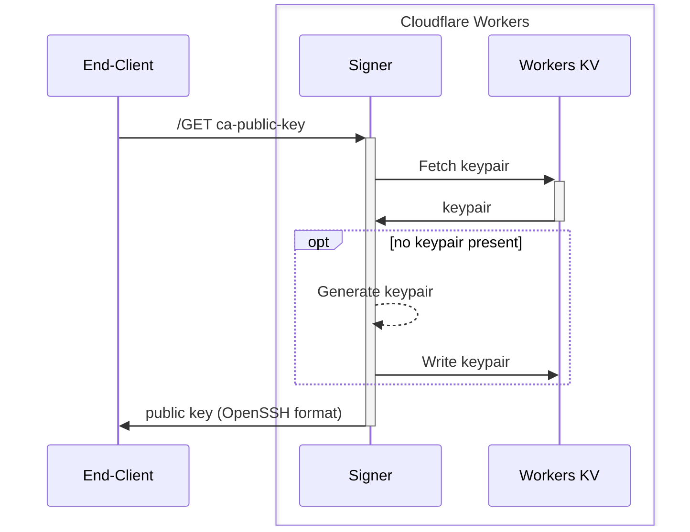
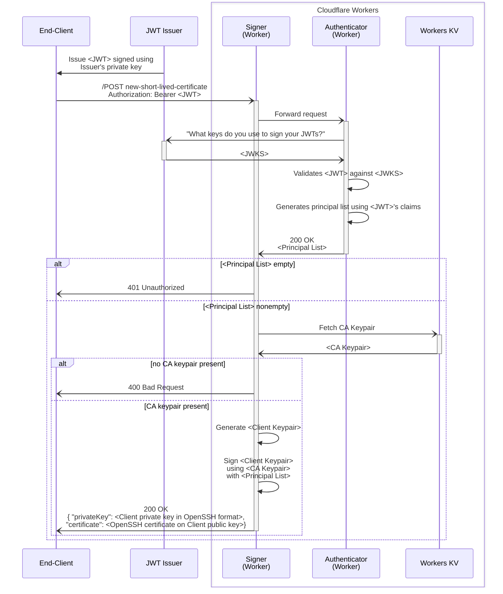

# `cf-worker-as-openssh-ca`

Turning Cloudflare Workers into a OpenSSH Certificate Authority that verifies incoming requests and issues short-lived SSH certificates.

## How it works

A successfully deployed system should consist of two independent systems, namely the **Signer** and the **Authenticator**.

### Overview

The following sequence diagrams illustrate how the Signer, the Authenticator (whose implementation is set to `authenticator/remote-jwt`) and the external JWT issuer interact upon `GET /ca-public-key` and `POST /new-short-lived-certificate` requests.

#### `GET /ca-public-key`

#### `POST /new-short-lived-certificate`

### The Signer

The Signer receives all incoming requests from (potentially untrusted) end-clients. It has the following HTTP endpoints:

- `GET /ca-public-key`:

  - retrieves an _OpenSSH CA keypair_ from the Workers KV
  - if no keypair has been already stored in Workers KV, generates it on the fly
  - returns the public key part in OpenSSH format (`"ssh-ed25519 AAAAC3N..."`)

- `POST /new-short-lived-certificate`:

  - authenticates the request by forwarding it to the Authenticator
    - if the request cannot be authenticated, returns `401 Unauthorized`
    - the authenticator returns a JSON Array in plaintext consisting of _Principal names_ to which the request qualifies
  - if the OpenSSH CA keypair has not been generated yet, returns `400 Bad Request`
  - generates a SSH key-pair
  - signs the generated public key using the CA's private key, with a short validity duration (configurable, default is 60 seconds) and the _Principal names_ returned from the Authenticator
  - returns a private key (in OpenSSH format) and a short-lived OpenSSH certificate signed using the OpenSSH CA keypair

### The Authenticator

The Authenticator _authenticates_ the identity of the end-clients by examining requests forwarded from the Signer. This component also _authorizes_ the end-clients by declaring to which principles the end-clients are eligible.

The implementation of the Authenticator is pluggable, but it must satisfy the following HTTP interface:

- `GET /<any path>`:
  - authenticates the request using the information present in the incoming request
  - always returns a `200 OK` with the response body containing a JSON Array of strings (`["principal1", "principal2", ...]`) consisting of Principal names to which the request qualifies
    - if the request cannot be authenticated or does not qualify any Principal name, an empty JSON Array (`[]`) must be returned.
